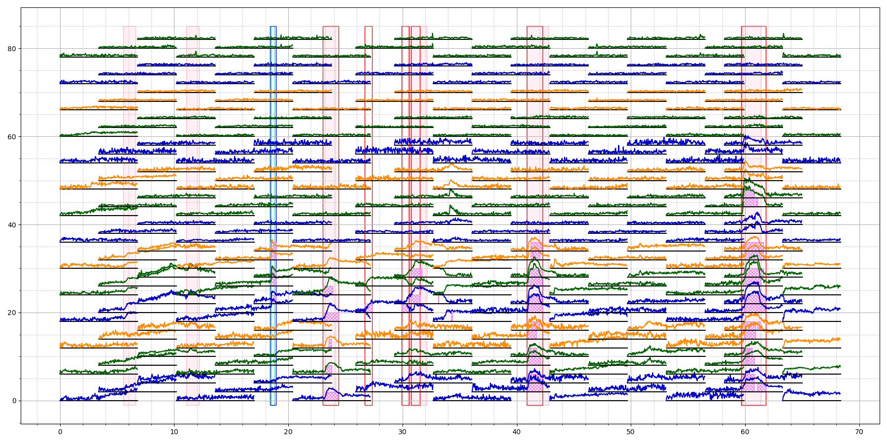

## Citations

Yuan Zhao, Xin Tong, Zichong Zhu, Jianda Sheng, Lei Dai, Lingling Xu, Xuehai Xia, Jiang Yu, Jiao Li. 2022. Rethinking Optical Flow Methods for Micro-Expression Spotting: The 30th ACM International Conference on Multimedia Proceedings (MM’22), October 10-14, 2022, Lisboa, Portugal. ACM, New York, NY, USA. 5 pages. https://doi.org/10.1145/3503161.3551602

## Introduction

The branch megc2022 is the source code the results which are submitted to [ACMMM 2022 Conference : Grand Challenges](https://openreview.net/group?id=acmmm.org/ACMMM/2022/Track/Grand_Challenges). 

We also improve the algorithm after the challenge. Some latest results are shown below.

## Results

Here shows some results after improve the algorithm, which is better than the results of the code on github.

table: performac on [CAS(ME)^2](http://fu.psych.ac.cn/CASME/cas(me)2-en.php)
iou|0.2|0.3|0.4|0.5
---|---|---|---|---
total precision|0.4551|0.4342|0.4175|0.3862
total recall|0.6140|0.5859|0.5633|0.5211
total F1-score|0.5227|0.4988|0.4796|0.4436
MaE precision|0.4682|0.4470|0.4305|0.4023
MaE recall|0.6633|0.6333|0.6100|0.5700
MaE F1-score|0.5489|0.5241|0.5048|0.4717
ME precision|0.3518|0.3333|0.3148|0.2592
ME recall|0.3333|0.3157|0.2982|0.2456
ME F1-score|0.3423|0.3243|0.3063|0.2522

  

fig shows the prediction of video 16_0101disgustingteeth in [CAS(ME)^2](http://fu.psych.ac.cn/CASME/cas(me)2-en.php). Boxes with filled color are the ground truth, and blank is the predictions.

[Video](results/analysis.mp4) shows the routing of predictions.
 
## Acknowledgements

Our article was inspired by the work of HE Yuhong ([Research on Micro-Expression Spotting Method Based on Optical Flow Features](https://dl.acm.org/doi/10.1145/3474085.3479225)), and the code can be downloaded [here](https://github.com/hitheyuhong/micro-expression-spotting-challenge/tree/e6fd67de3c10a8bd7647501742e40ee4ef4c3d12).

## Reference

[1] Qu, F., Wang, S. J., Yan, W. J., Li, H., Wu, S., & Fu, X. (2017). CAS(ME)2: a database for spontaneous macro-expression and micro-expression spotting and recognition. IEEE Transactions on Affective Computing, 9(4), 424-436.
