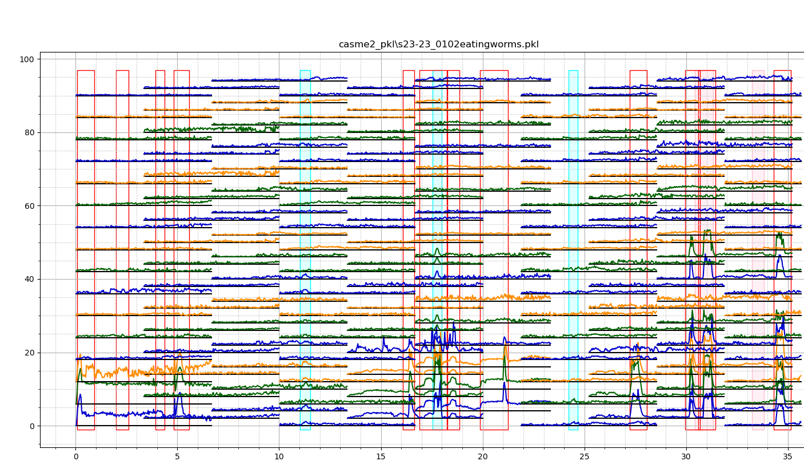

## Citations

## Related Paper

The project is the sorcecode for the paper of *"Rethinking Optical Flow Methods for Micro-Expression Spotting"*, which is submitted to [ACMMM 2022 Conference : Grand Challenges](https://openreview.net/group?id=acmmm.org/ACMMM/2022/Track/Grand_Challenges).
  
## Introduction
  

  

   
In this paper, the micro-expression occurrence interval is analyzed according to the optical flow of the local motion of the micro-expression.

## Related Datasets
 

  
## Acknowledgements

Our article was inspired by the work of HE Yuhong ([Research on Micro-Expression Spotting Method Based on Optical Flow Features](https://dl.acm.org/doi/10.1145/3474085.3479225)), and the code can be downloaded [here](https://github.com/hitheyuhong/micro-expression-spotting-challenge/tree/e6fd67de3c10a8bd7647501742e40ee4ef4c3d12).
